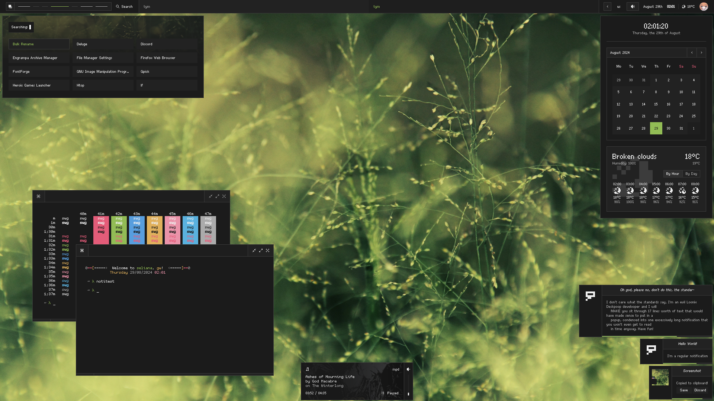

Welcome to this humble [AwesomeWM](https://awesomewm.org/) configuration that I made off
my [modularized default rc.lua](https://github.com/Gwynsav/modular-awm-default), focused
on being clean, simple and fast to use.

> [!WARNING]
> I have very bizarre ideas and am shameless enough to actually implement them here.
Sometimes these ideas make the WM very slow or unstable, so please beware my incompetence.

## Installation

As of right now, this is only the AwesomeWM configuration, so to install it just:
```
# Assuming ~/.config/ exists.
git clone https://github.com/gwynsav/gwileful.git ~/.config/awesome --recursive
```
There are also some variables in the `config` directory, so make sure everything is
defined correctly.

## Gallery



## References and Acknowledgements

- Again, my [modularized default rc.lua](https://github.com/Gwynsav/modular-awm-default).
- All projects used as submodules of this one.
- [Feather Icons](https://feathericons.com/).
- [Fairfax](https://www.kreativekorp.com/software/fonts/fairfaxhd/).
